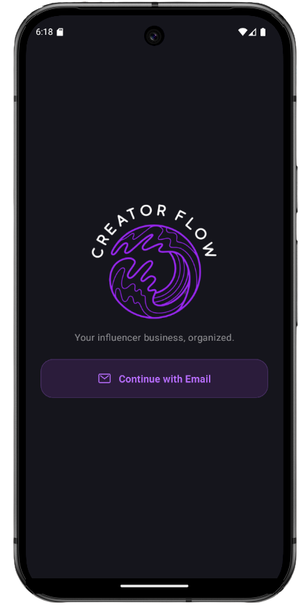

# 📱 Creator Flow
### Manage campaigns. Track income. Grow your creator business.

<p align="center">
  
</p>
 
Creator Flow es una aplicación móvil desarrollada con **React Native y Expo**, diseñada para ayudar a creadores de contenido e influencers a gestionar todas sus colaboraciones con marcas desde un solo lugar. La aplicación permite administrar campañas, controlar ingresos y gastos, visualizar métricas, organizar fechas importantes y acceder rápidamente a las principales plataformas sociales.

## 📂 Código fuente

https://github.com/violetaatkinson/creator-flow

---

## ✨ Características principales

- 📋 Creación y gestión completa de campañas.
- ✏️ Edición de campañas (fechas, presupuesto, plataforma y estado).
- 📅 Calendario con próximos deadlines.
- 📚 Historial de campañas completadas.
- 💰 Panel financiero con ingresos mensuales.
- 📉 Registro de gastos y cálculo automático de ganancias netas.
- 📊 Estadísticas mensuales de campañas e ingresos.
- 👤 Perfil personalizable con foto y alias.
- 📥 Descarga de reportes mensuales, semestrales y anuales.
- 📱 Registro manual de seguidores por plataforma.
- 🔗 Acceso directo a redes sociales.
- 🏠 Dashboard con resumen completo de la actividad.
- 📈 Gráfico anual de campañas.
- 🔔 Centro de notificaciones para campañas, pagos y gastos.

---

## 🛠️ Tecnologías utilizadas

- React Native
- Expo
- React Navigation
- JavaScript ES6+
- React Hooks
- Redux Toolkit
- Redux Persist
- RTK Query
- Firebase Authentication
- Firebase Firestore
- SQLite
- Async Storage
- Expo Camera
- Expo Location
- Google Maps Static API
- Yup
- FlatList

---

## 📚 Conceptos aplicados del curso

### 📦 Módulo 1 – Fundamentos de React Native

- Configuración del entorno con Expo.
- Creación del proyecto.
- Configuración del emulador Android.
- Introducción a React Native.
- Ejecución y visualización de la aplicación.

### 🎨 Módulo 2 – Props, State y Diseño Responsive

- Manejo de Props y State.
- Renderizado condicional.
- Flexbox y diseño responsive.
- Validación de formularios.
- Comunicación entre componentes.
- Safe Areas e imágenes.

### 🧭 Módulo 3 – Navegación

- Stack Navigation.
- Bottom Tabs.
- Paso de parámetros entre pantallas.
- Navegación con React Navigation.
- Personalización de Headers.
- Arquitectura de navegación.

### 🏗️ Módulo 4 – Arquitectura

- Organización del proyecto.
- Separación de componentes.
- Constantes globales.
- FlatList.
- Renderizado dinámico.
- Integración de datasets.

### ⚡ Módulo 5 – Eventos y Estado

- Eventos de interacción.
- useState.
- Modales.
- Confirmaciones.
- Optimización de listas.
- Gestión dinámica de campañas.

### 💾 Módulo 6 – Persistencia

- SQLite.
- Async Storage.
- Persistencia de sesión.
- Logout.
- Expo Location.
- Geocoding.
- Google Maps Static API.

### 🌍 Módulo 7 – Estado Global y Backend

- Redux Toolkit.
- Redux Persist.
- RTK Query.
- Firebase Firestore.
- Estado global para campañas, finanzas y perfil.

### 🔐 Módulo 8 – Autenticación y Perfil

- Firebase Authentication.
- Registro e inicio de sesión.
- Validación con Yup.
- Navegación protegida.
- Cámara.
- Gestión de imágenes de perfil.
- Persistencia del usuario autenticado.

---

## 📂 Estructura del proyecto

```text
creator-flow/
│
├── assets/
│
├── src/
│   ├── assets/
│   ├── components/
│   ├── constants/
│   ├── database/
│   ├── firebase/
│   ├── navigation/
│   ├── screens/
│   ├── services/
│   └── store/
│
├── App.js
├── index.js
├── app.json
├── package.json
└── README.md
```

---

## 🎯 Objetivo del proyecto

Desarrollar una aplicación móvil completa para creadores de contenido, aplicando los principales conceptos de React Native, navegación, estado global, persistencia de datos y autenticación. El proyecto busca ofrecer una herramienta que centralice la gestión de campañas, el control financiero y el seguimiento del rendimiento de un influencer mediante una interfaz intuitiva, moderna y optimizada para dispositivos móviles.

---

## 👩‍💻 Autora

**Violeta Atkinson**

Proyecto final desarrollado durante el curso **React Native - Coderhouse**.