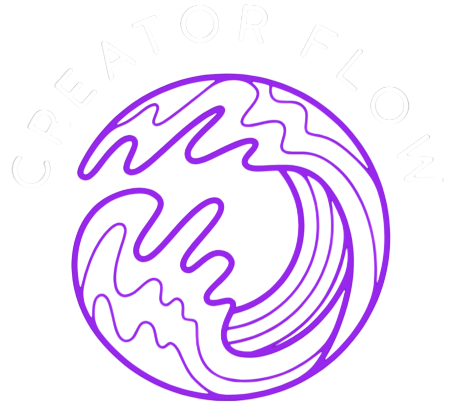
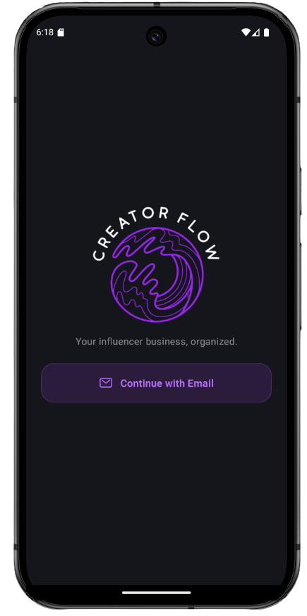

<p align="center">
  
</p>

<h1 align="center">Creator Flow</h1>

<p align="center">
  <strong>Manage campaigns. Track income. Grow your creator business.</strong>
</p>

<p align="center">
  A mobile application built with <strong>React Native</strong> and <strong>Expo</strong> to help influencers and content creators manage brand collaborations, finances, and performance metrics.
</p>

<p align="center">
  
</p>

---

# 📱 About the Project

**Creator Flow** is a mobile application developed with **React Native and Expo**, designed to help content creators and influencers manage their entire creator business from one centralized platform.

The application allows users to organize brand collaborations, track campaign progress, manage income and expenses, visualize performance metrics, receive notifications, and maintain important creator information.

The goal of Creator Flow is to simplify the workflow of digital creators by combining campaign management and financial tracking into a modern, intuitive mobile experience.

---

# 📂 Source Code

Repository:

https://github.com/violetaatkinson/creator-flow

---

# ✨ Main Features

## 📋 Campaign Management

* Create and manage brand collaboration campaigns.
* Edit campaign details such as:

  * Brand name
  * Platform
  * Budget
  * Deadlines
  * Campaign status
* Track active, pending, completed, and paused campaigns.
* View upcoming deadlines.

## 💰 Financial Dashboard

* Track creator income.
* Register expenses.
* Calculate net earnings.
* View monthly financial summaries.
* Generate financial reports.

## 📊 Analytics & Performance

* Campaign statistics.
* Annual campaign charts.
* Income visualization.
* Creator performance tracking.

## 👤 Creator Profile

* Customizable user profile.
* Profile image management.
* Creator alias.
* Social media information.

## 🔔 Notifications

* Campaign reminders.
* Payment notifications.
* Expense alerts.

## 📱 Social Media Management

* Manual follower tracking.
* Quick access to social media platforms.

---

# 🛠️ Technologies Used

### Frontend

* React Native
* Expo
* JavaScript ES6+
* React Navigation
* React Hooks
* FlatList

### State Management

* Redux Toolkit
* Redux Persist
* RTK Query

### Backend & Database

* Firebase Authentication
* Firebase Firestore
* SQLite
* Async Storage

### Additional Libraries

* Expo Camera
* Yup
* Expo Location
* Google Maps Static API

---

# 📚 React Native Concepts Applied

## 📦 Module 1 – React Native Fundamentals

* Expo environment configuration.
* React Native project creation.
* Android emulator setup.
* Component-based architecture.
* Running and testing the application.

---

## 🎨 Module 2 – Props, State & Responsive Design

* Props and state management.
* Conditional rendering.
* Flexbox layouts.
* Responsive mobile design.
* Form validation.
* Component communication.
* Safe Areas and image handling.

---

## 🧭 Module 3 – Navigation

* Stack Navigation.
* Bottom Tab Navigation.
* Navigation parameters.
* Protected routes.
* Custom headers.
* Navigation architecture.

---

## 🏗️ Module 4 – Application Architecture

* Project organization.
* Component separation.
* Global constants.
* Dynamic lists with FlatList.
* Data rendering.

---

## ⚡ Module 5 – Events & Application State

* User interaction events.
* useState management.
* Modal components.
* Confirmation dialogs.
* Dynamic campaign management.

---

## 💾 Module 6 – Data Persistence

* SQLite integration.
* Async Storage.
* Session persistence.
* User logout functionality.
* Location services.

---

## 🌍 Module 7 – Global State & Backend Integration

* Redux Toolkit implementation.
* Redux Persist.
* RTK Query.
* Firebase Firestore integration.
* Global state management for:

  * Campaigns
  * Finances
  * User profile

---

## 🔐 Module 8 – Authentication & User Profile

* Firebase Authentication.
* User registration and login.
* Yup validation schemas.
* Protected navigation.
* Camera integration.
* Profile image management.
* Persistent authentication sessions.

---

# 📂 Project Structure

```text
creator-flow/
│
├── assets/
│
├── src/
│   ├── assets/
│   ├── components/
│   ├── constants/
│   ├── database/
│   ├── firebase/
│   ├── navigation/
│   ├── screens/
│   ├── services/
│   └── store/
│
├── App.js
├── index.js
├── app.json
├── package.json
└── README.md
```

---

# 📱 Installation & Testing

## Android APK

Creator Flow includes an Android test build generated with **Expo Application Services (EAS)**.

Test build:

https://expo.dev/accounts/violeatkin/projects/creator-flow/builds/687bfa77-7b35-440c-be95-2f43d6b1fb3f

To install:

1. Open the build link on an Android device.
2. Download the APK.
3. Allow installation from unknown sources if requested.
4. Install and open Creator Flow.

The test build allows validation of:

* User authentication.
* Navigation flow.
* Campaign management.
* Financial features.
* Firebase integration.
* Data persistence.

---

# 🧪 Development Testing

Run the project locally:

Install dependencies:

```bash
npm install
```

Start Expo:

```bash
npx expo start
```

Run on Android emulator:

```bash
npx expo run:android
```

---

# 🚀 Future Improvements

* Google Play Store release.
* Instagram API integration.
* Automatic follower synchronization.
* Creator marketplace.
* Advanced analytics dashboard.
* AI-powered campaign recommendations.
* Push notifications.
* Premium subscription plans.

---

# 🎯 Project Goal

The objective of Creator Flow was to build a complete mobile application applying modern React Native development concepts, including navigation, state management, backend integration, authentication, and data persistence.

The project demonstrates how mobile technology can help creators organize their professional workflow, manage collaborations, and make better financial decisions through a centralized platform.

---

# 👩‍💻 Author

**Violeta Atkinson**

Final project developed during the **React Native Course - Coderhouse**.

Technologies, architecture, and features were implemented as part of a complete mobile application development process.
